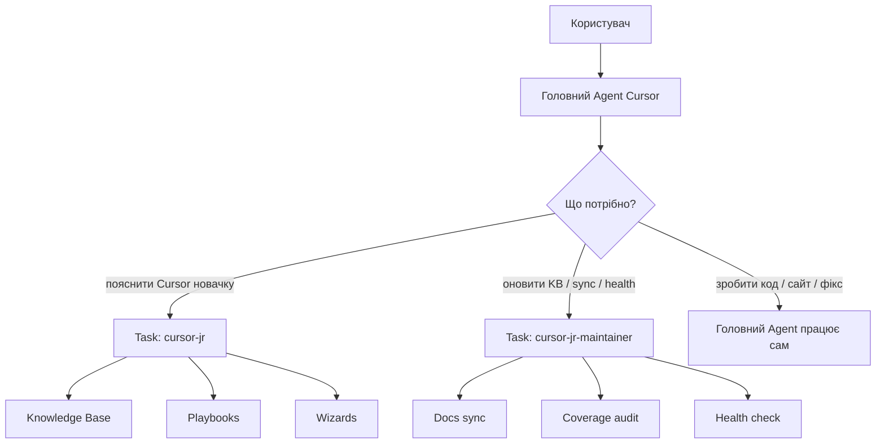
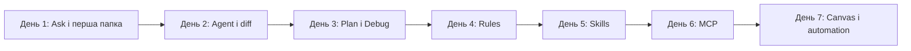
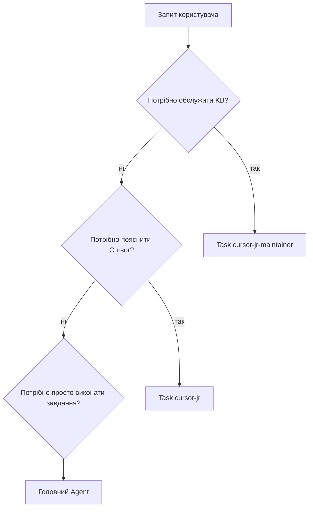

# CursorJr

**CursorJr** — україномовний субагент-наставник для Cursor. Він допомагає звичайним людям: підприємцям, маркетологам, дизайнерам, контентникам і новачкам у розробці — зрозуміти Cursor, автоматизувати рутину та безпечно делегувати завдання AI-агенту.

CursorJr пояснює без техножаргону: що натиснути, який режим обрати, як не зламати проєкт, як підключати MCP, створювати rules/skills, збирати звіти в Canvas і перетворювати повторювані завдання на зрозумілі сценарії.

[](#швидке-локальне-встановлення)

## Для кого

- Для тих, хто відкрив Cursor вперше і не розуміє, з чого почати.
- Для підприємців, яким потрібен AI-помічник для рутини, контенту та процесів.
- Для маркетологів і контентників, які хочуть швидше збирати тексти, лендинги, SEO-структури, звіти та контент-плани.
- Для дизайнерів і продюсерів, яким треба пояснити Cursor простими словами і без "програмістського входу".
- Для команд, де Cursor має стати зрозумілим робочим інструментом, а не страшною IDE.

## Що вміє

- Пояснює `Ask`, `Plan`, `Agent`, `Debug` людською мовою.
- Допомагає безпечно робити перші правки через diff і checkpoints.
- Пояснює `Rules`, `Skills`, `Subagents`, `MCP`, `Canvas`, Automations і Hooks.
- Показує, як автоматизувати повторювану роботу.
- Підказує, коли потрібне rule, skill, MCP чи повноцінна automation.
- Веде новачка 7-денним маршрутом навчання.
- Розбирає типові проблеми: "агент усе зламав", "боюся терміналу", "MCP не з'явився", "немає Publish у Canvas".
- Має окремого maintainer-субагента для оновлення бази знань.

## Як це влаштовано



## Маршрут новачка



## Коли викликати CursorJr



## Встановлення

### Швидке локальне встановлення

Скопіюйте команду в PowerShell із папки, куди хочете завантажити CursorJr:

```powershell
git clone https://github.com/Horosheff/cursor-jr.git; cd cursor-jr; .\scripts\install-plugin.ps1
```

Після встановлення перезапустіть Cursor.

### Ручне встановлення

Склонуйте репозиторій і запустіть встановлення:

```powershell
git clone https://github.com/Horosheff/cursor-jr.git
cd cursor-jr
.\scripts\install-plugin.ps1
```

Перезапустіть Cursor.

Після встановлення доступні:

- `Task(cursor-jr)` — наставник для новачків.
- `Task(cursor-jr-maintainer)` — обслуговування бази знань.
- `/cursor-jr` — ручний виклик наставника.
- `/cursor-jr-sync` — оновлення бази знань.
- `/cursor-jr-maintain` — maintainer workflow.
- `/cursor-jr-health` — перевірка здоров'я встановлення.

## Перевірка

```powershell
.\scripts\verify-install.ps1
.\scripts\health-check.ps1
```

Очікуваний результат:

- `cursor-jr` встановлено як readonly-субагент.
- `cursor-jr-maintainer` встановлено як maintainer-субагент.
- Старий конфліктний skill `cursor-jr` відсутній.
- Coverage бази знань без пропусків.
- Тести поведінки проходять.

## Структура проєкту

| Папка | Призначення |
|-------|-------------|
| `agents/` | Субагенти `cursor-jr` і `cursor-jr-maintainer` |
| `rules/` | Маршрутизація: коли кликати CursorJr |
| `commands/` | Slash-команди для Cursor |
| `knowledge-base/` | Спрощена база знань Cursor українською |
| `playbooks/` | Практичні сценарії: перший запуск, automation, MCP, rollback |
| `wizards/` | Покрокові майстри для типових завдань |
| `profiles/` | Профілі новачків: підприємець, маркетолог, дизайнер тощо |
| `scripts/` | Встановлення, sync, coverage, health-check |
| `tests/` | Тестові сценарії поведінки субагента |

## База знань

CursorJr спирається на карту офіційної документації Cursor. Кореневі розділи:

- https://cursor.com/ru/docs
- https://cursor.com/ru/learn
- https://cursor.com/ru/help
- https://cursor.com/ru/docs/api

Окремо індексуються десятки конкретних сторінок за темами:

- Agent, Ask Mode, Plan Mode, Debug Mode, Design Mode і Agent Review;
- Terminal, Browser, Search і Canvas tools;
- Rules, Skills, Subagents і MCP;
- Security, Run Modes і permissions;
- Cloud Agents, Automations і Hooks;
- Teams, Dashboard, usage limits, integrations, Bugbot і Security Agents;
- CLI, SDK і Cloud Agent API.

Карта опрацьованих URL лежить у `knowledge-base/manifest.json`, покриття перевіряється скриптом `scripts/audit-coverage.ps1`.

У репозиторії лежать не "сирі копії документації", а спрощені україномовні картки, playbooks і wizards для новачків.

## Автоматизація та MCP

CursorJr допомагає звичайному користувачу зрозуміти:

- коли достатньо простого правила `rule`;
- коли потрібен повторюваний рецепт `skill`;
- коли підключати зовнішній сервіс через `MCP`;
- коли робити повноцінну automation;
- як перевіряти безпеку перед запуском команд.

## Для авторів і команд

Якщо ви навчаєте команду Cursor, використовуйте:

- `knowledge-base/learning-path-7-days.md` — міні-курс на тиждень;
- `knowledge-base/typical-beginner-failures.md` — база типових проблем;
- `routing-test-cases.md` — матриця маршрутизації;
- `scripts/health-check.ps1` — швидка перевірка встановлення.

## Неофіційний проєкт

CursorJr не афілійований з Cursor Inc. Це відкритий україномовний помічник для навчання та впровадження Cursor. Оригінальний проєкт: [Horosheff/cursor-jr](https://github.com/Horosheff/cursor-jr).

## Ліцензія

MIT
