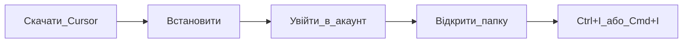

## Простими словами

Cursor — програма-редактор з вбудованим AI. Як Word, але для коду і текстових файлів, з розумним помічником всередині.

## Коли вам це потрібно

Перший запуск: скачали Cursor і не знаєте, що натиснути далі.

## Покроково

1. Скачайте з [cursor.com](https://cursor.com) (Windows: `.exe`, Mac: `.dmg`)
2. Встановіть і відкрийте програму
3. Увійдіть в акаунт (потрібен для Agent)
4. **File → Open Folder** — виберіть папку з проєктом (або створіть порожню)
5. Відкрийте Agent: **Windows/Linux `Ctrl+I`**, **Mac `Cmd+I`**

## Схема

## Часті помилки

- Відкрили файл, а не папку — Agent гірше бачить проєкт. Відкрийте **папку**.
- Не увійшли в акаунт — Agent може бути недоступний.

## Офіційне посилання

https://cursor.com/ru/docs/get-started/quickstart
