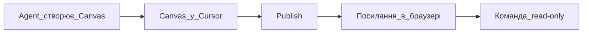

## Простими словами

**Canvas** — інтерактивний «полотно» поруч із чатом: звіт, дашборд, таблиця зі статистикою. Не довгий текст у чаті, а окремий екран із блоками і цифрами.

**Shared Canvas** — опублікований холст: ви натискаєте **Publish**, отримуєте посилання, колеги відкривають той самий вид у браузері (тільки перегляд).

## Коли вам це потрібно

- Потрібен звіт або дашборд, а не простирадло тексту в чаті
- Хочете показати результат команді без пересилання всього діалогу
- Маркетинг, аналітика, аудит — все, що зручніше бачити таблицею і графіком

## Canvas vs звичайна відповідь у чаті

| | Відповідь у чаті | Canvas |
|--|-----------------|--------|
| Формат | Текст, markdown | Інтерактивний макет |
| Зручно для | Короткі відповіді | Звіти, дашборди, таблиці |
| Повторне відкриття | Гортати чат | Список canvas у проєкті |
| Ділитися з командою | Копіювати чат | **Shared Canvas** (посилання) |

## Покроково: створити Canvas

1. В Agent попросіть: «Зроби звіт / дашборд по [темі] у canvas»
2. В кінці відповіді з'явиться **картка** — натисніть, щоб відкрити
3. Або Command Palette → **Open Canvas** (розділ View)
4. Перевірте цифри і заголовки; попросіть агента поправити, якщо потрібно
5. Canvas зберігається в списку canvas проєкту — можна відкрити пізніше

## Покроково: Shared Canvas (поділитися з командою)

**Потрібно заздалегідь:**

- Тариф **Pro**, **Teams** або **Enterprise** (Hobby — не можна)
- Ви в **команді** (team)
- **Не** Legacy Privacy Mode (блокує публікацію)

**Кроки:**

1. Відкрийте готовий Canvas
2. Натисніть **Publish** на панелі інструментів
3. Скопіюйте посилання і надішліть колегам
4. Колеги відкривають у браузері — **тільки перегляд**
5. Дані змінились — знову **Publish** (оновити знімок)
6. Адмін команди: Dashboard → **Shared Canvases** — список і відключення для організації

## Схема

## Частые помилки

- Чекаєте canvas без явного прохання — скажіть: «відкрий результат у canvas»
- **Publish** неактивний — перевірте тариф, команду і Privacy Mode
- Ділитесь до перевірки цифр — колеги побачать помилки у знімку

## Офіційне посилання

https://cursor.com/docs/agent/tools/canvas
