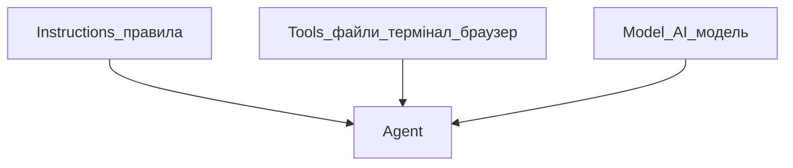

## Простими словами

**Agent** — помічник, який сам шукає файли, вносить правки і запускає команди. Ви описуєте мету — він виконує.

## Коли вам це потрібно

Потрібно щось зробити в проєкті: створити сторінку, виправити помилку, налаштувати файл.

## Три кити Agent

| Компонент | Що це | Аналогія |
|-----------|-------|----------|
| **Instructions** | Rules і системні підказки | Посадова інструкція |
| **Tools** | Читання файлів, термінал, браузер | Інструменти на столі |
| **Model** | Вибрана AI-модель | Який спеціаліст думає |

## Покроково

1. `Ctrl+I` (Win) / `Cmd+I` (Mac)
2. Опишіть завдання простою мовою
3. Стежте за **diff** — що змінюється
4. Прийміть або відхиліть правки

## Що вміє Agent (інструменти)

- Шукати по проєкту
- Читати і редагувати файли
- Запускати команди в терміналі
- Шукати в інтернеті
- Працювати з браузером (тести сторінок)
- Генерувати зображення (макети)

## Часті помилки

- Чекаєте, що Agent «знає все» без контексту — вкажіть `@file` або опишіть завдання чіткіше
- Не дивитесь diff — завжди перевіряйте зміни

## Офіційне посилання

https://cursor.com/ru/docs/agent/overview
