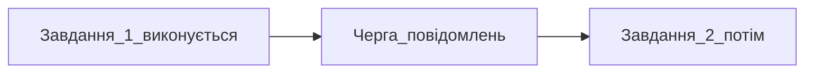

## Простими словами

Поки Agent працює, ви можете **поставити наступне завдання у чергу** — воно виконається автоматично, коли поточне закінчиться.

## Коли вам це потрібно

Agent ще думає, а ви вже знаєте наступний крок.

## Покроково

1. Agent виконує завдання
2. Введіть наступну інструкцію
3. **Enter** — повідомлення в **чергу** (зачекає)
4. **Ctrl+Enter** (Win) / **Cmd+Enter** (Mac) — **одразу**, перервати поточний напрямок

## Схема

## Часті помилки

- Ctrl+Enter коли не хотіли переривати — використовуйте звичайний Enter для черги

## Офіційне посилання

https://cursor.com/ru/docs/agent/overview
