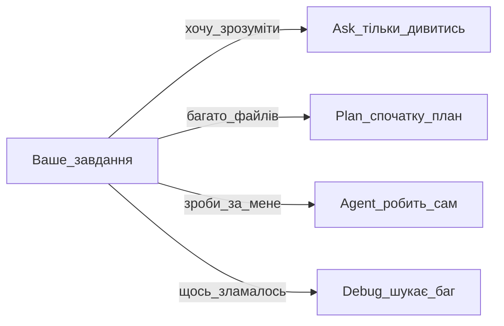

## Простими словами

У Cursor чотири «режими роботи» помічника. Як різні відділи: один тільки дивиться, інший робить, третій спочатку планує.

## Таблиця режимів

| Режим | Краще для | Змінює файли? |
|-------|-----------|---------------|
| **Agent** | Зробити завдання, рефакторинг, фікс | Так |
| **Ask** | Зрозуміти код, поставити запитання | Ні (тільки читання) |
| **Plan** | Велике завдання на багато файлів | Так, після вашого «ОК» на план |
| **Debug** | Складні баги | Так |

## Схема вибору

## Як переключити

- **Shift+Tab** у полі введення Agent
- Або випадаючий список режиму на панелі Agent

## Важливо

У кожного режиму **свій контекст**. Змінили завдання — починайте **новий чат**.

## Покроково (типовий день)

1. **Ask:** «Поясни, як влаштований цей проєкт»
2. **Plan:** «Додай форму зворотного зв'язку на 3 сторінки»
3. Схваліть план → Agent будує
4. **Debug:** якщо щось зламалось і незрозуміло чому

## Часті помилки

- Plan не схвалили — Agent не почне код (це норма)
- Змішали два великі завдання в одному чаті — контекст переповниться

## Офіційне посилання

https://cursor.com/ru/help/ai-features/agent
