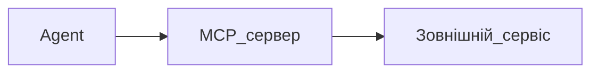

## Простими словами

**MCP** (Model Context Protocol) — спосіб підключити до Cursor зовнішні сервіси: браузер, документацію, WordPress, аналітику тощо.

## Аналогія

Як USB-роз'єми: один стандарт — багато пристроїв. MCP — «роз'єм» для інструментів AI.

## Коли вам це потрібно

Agent має не тільки правити файли, але й ходити в API, браузер, бази.

## Покроково (загальна схема)

1. Файл `.cursor/mcp.json` у проєкті (або налаштування MCP у Cursor)
2. Додайте сервер за інструкцією постачальника
3. Перезапустіть Cursor
4. В Agent перевірте: «які MCP tools доступні?»

## Схема

## Часті помилки

- Невірний JSON у mcp.json — весь MCP не завантажиться
- Секрети в Git — зберігайте в env, не в репозиторії

Детальний playbook: `playbooks/02-podklyuchit-mcp.md`

## Офіційне посилання

https://cursor.com/ru/docs/context/mcp
