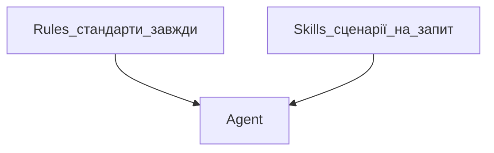

## Простими словами

**Skill** — покроковий рецепт для повторюваного завдання. Rules кажуть «як завжди»; Skill — «як зробити ось це».

## Коли вам це потрібно

Одна й та сама операція: чеклист публікації, SEO-перевірка, деплой.

## Де лежать

- Проєкт: `.cursor/skills/nazva-skill/SKILL.md`
- Глобально: `~/.cursor/skills/nazva-skill/SKILL.md`

## Покроково

1. Створіть папку `.cursor/skills/miy-skill/`
2. Файл `SKILL.md` з блоком:

```markdown
---
name: miy-skill
description: Коли потрібен чеклист перед публікацією
---
```

3. Опишіть кроки в тілі файлу
4. Agent підхопить skill за описом або викличіть `/miy-skill`

## Rules vs Skills



## Часті помилки

- Skill без `description` — Agent не зрозуміє, коли викликати
- Плутати skill з rule — rule коротше і «завжди», skill — workflow

## Офіційне посилання

https://cursor.com/docs/skills
