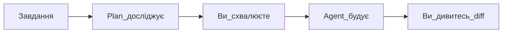

## Простими словами

**Plan Mode** — спочатку план на папері (у чаті), ви читаєте і схвалюєте, потім код.

## Коли вам це потрібно

Завдання зачіпає багато файлів або ви боїтесь, що Agent зробить не те.

## Покроково

1. `Shift+Tab` → виберіть **Plan**
2. Опишіть завдання
3. Agent досліджує проєкт і поставить уточнювальні запитання
4. З'явиться **план** — прочитайте
5. Натисніть схвалення — Agent почне правки
6. Дивіться diff по кроках

## Схема

## Часті помилки

- Чекаєте код одразу — у Plan спочатку тільки план
- Схвалили не читаючи — ризик зайвої роботи

## Офіційне посилання

https://cursor.com/ru/docs/get-started/quickstart
