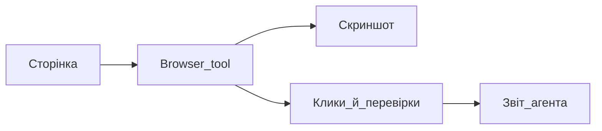

# Browser tool — перевірка сайту очима агента

## Простими словами

Browser tool дозволяє Agent відкрити сторінку, натискати кнопки, робити скриншоти і перевіряти інтерфейс як звичайний користувач.

## Коли вам це потрібно

- Перевірити лендинг після правок
- Знайти візуальну помилку
- Протестувати форму
- Порівняти дизайн з очікуванням

## Покроково

1. Запустіть сайт локально або дайте URL
2. Попросіть: «Відкрий сторінку і перевір, що бачить користувач»
3. Agent зробить snapshot або скриншот
4. Попросіть перевірити конкретний сценарій: кнопка, форма, меню
5. Після перевірки попросіть список проблем і що виправити

## Схема

## Часті помилки

- Не запущений локальний сайт
- Потрібен логін або captcha — Agent не повинен обходити вручну
- Не вказали, який сценарій перевіряти

## Офіційне посилання

https://cursor.com/docs/agent/tools/browser
