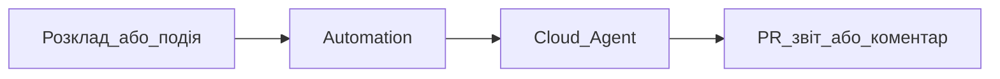

# Automations — автоматичний запуск агентів

## Простими словами

Automations — це коли агент запускається сам: за розкладом, подією або webhook. Наприклад, «щоранку перевірити issue» або «після події в GitHub підготувати PR».

## Коли це потрібно

- Регулярні перевірки
- Щоденні звіти
- Автоматичні PR
- Інтеграції з GitHub/Slack/Linear

## Схема

## Для новачка

Не починайте з Automations. Спочатку зробіть завдання вручну через Agent, потім перетворіть повторюване завдання в automation.

## Офіційне посилання

https://cursor.com/docs/cloud-agent/automations
